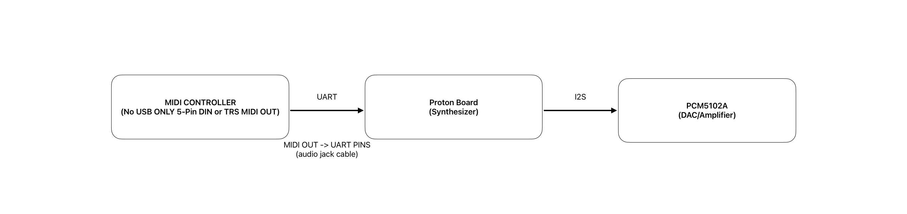
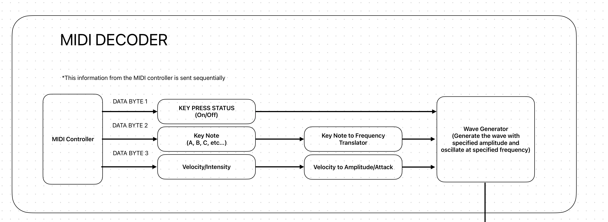
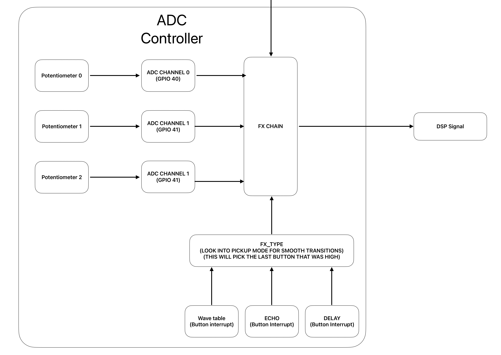

# Synthesizer

## Design Overview
The high level design of this synth can be visualized in the figure below: 

### Midi Controller
The midi controller will use UART to send midi information to the proton board. The three pieces of information contained in the midi are: 
<ul>
<li>key status (pressed/released)</li>
<li>keynote (C, D#, etc..)</li>
<li>velocity </li>
</ul>

These three pieces of **sequential** information will be used to represent this signal digitally. Each note has a corresponding frequency associated with it. For example, middle C note is the frequency 261.63Hz (A440 tuning system). We will need a lookup table to translate the key note to a frequency. Luckily our lookup table will only need to span one octave since the relationship between two notes an octave apart is $f_{low} * 2 = f_{high}$.  

With the velocity information also a part of the midi data, we can implement one of two things: the amplitude of the wave sensitive to velocity or the attack of the wave sensity to velocity. Implementing velocity sensitive attack will most likely be more difficult than simply being amplitude sensitive.

#### Attack vs Amplitude
The attack controls how fast the sound will get to its highest volume when the key is first pressed. A faster attack means a more percusive sound. On the other hand, a slower attack means that the sound will crescendo over a longer time to its highest volume. As for the amplitude, it simply adjusts the overall volume of the sound. It can not create crescendos or swells that will dynamically change the sound when you play a note.

### ADC Controller

The ADC controller will be in charge of sending analog inputs into the FXs chain of the synthesizer.

For now we will have three ADC channels that correspond to three potentiometers. These channels should use the **DMA** to read from the ADC FIFO and write to a specified address so that we don't add any unncessary computation for the CPU.

Additionally, there will be three buttons that will correspond to three different types of FXs. There will be one button for the wavetable, and two buttons for the other two FXs. When toggling the button, the synthesizer will intepret the ADC channels as parameters specific to the corresponding FXs. For example if the wave table button was toggled:
<ul>
    <li> potentiometer 1 will adjust the type of wave generated (sine, sawtooth, square, etc...)</li>
    <li> potentiometer 2 will adjust the decay of the wave (does the sound get softer the longer it's played)</li>
    <li>potentiometer 3 will adjust the mix of the signal (overall volume)</li>

</ul> 

While this design allows us to use our ADC channels sparingly (RP2350 only has 8), we need to address what happens between toggling different buttons as there will be discontinuity in parameter values from the previous state to the current state.

### Parameter Discontinuity Issue
The parameter discontinuity issue arises when the following happens:  

Let's say we are currently on the wave table FX. For the purpose of simplicity we will say that each potentiometer has 3 discrete modes mode 0, 1, and 2. I want to turn the first potentiometer to mode 1 for a sawtooth wave. Then I want to adjust the mix of the signal to be at full volume so I turn the mode of the potentiometer 3 to mode 2. Finally, I adjust the decay of the wave to mode 0.

## Project Proposal

### Team Members:
torre324, bradfoh

### Project Objectives

<ul>
    <li>An ability to use the SPI to communicate with an external LCD display to show FX parameter values  </li>
    <li>An ability to configure GPIO pins to read ADC input in order to adjust the parameters for the FX chain</li>
    <li>An ability to use PIO peripheral to implement the I2S protocol for communicating with the DAC
    <li>An ability to use UART in order to read midi data from a midi controller </li>
</ul>

### Description

The goal of this project is to make a single oscillator synthesizer. The midi controller will send midi information (keynote status, keynote, velocity) over UART to the proton board which will generate a waveform for the corresponding frequency of the note played. Using ADC pins, the user will have the option to adjust potentiometers in order to control the paramters of the FXs. The final processed wave will go through a DAC (PCM5102A) in order to output the analog audio signal.

### Parts

[Midi Controller](https://www.amazon.com/Donner-N-25-Controlle-Velocity-Sensitive-Production/dp/B0C1ZC45F5/?_encoding=UTF8&pd_rd_w=Grd2g&content-id=amzn1.sym.4efc43db-939e-4a80-abaf-50c6a6b8c631%3Aamzn1.symc.5a16118f-86f0-44cd-8e3e-6c5f82df43d0&pf_rd_p=4efc43db-939e-4a80-abaf-50c6a6b8c631&pf_rd_r=B1KF2GA14WK6RNKPRT24&pd_rd_wg=U7XjY&pd_rd_r=86d487fc-a9b1-4629-b7ee-289ac83ccf03&ref_=pd_hp_d_atf_ci_mcx_mr_ca_hp_atf_d&th=1) 
[DAC PCM5102A](https://www.amazon.com/dp/B09C5QX228?ref=ppx_yo2ov_dt_b_fed_asin_title) 
SMH1602 LCD - In Lab kit  
10K potentiometers - In lab Kit  
Buttons - In Lab Kit

### Related Works

Title: Implmenting I2S with PIO  
URL: [URL](https://github.com/raspberrypi/pico-extras/tree/master/src/rp2_common/pico_audio_i2s)  
Differences: This is just one aspect that will be using in order to implement our project. We will likley need to adjust the output bit rate using a clock divider.

Title: Raspberry Pi Synth Board  
URL: [URL](https://diyelectromusic.com/2022/09/25/raspberry-pi-v1-model-b-synth-board-part-2/)  
Differences: This synthesizer was made using a Raspberry Pi Model B which has builtin I2S interface. Our proton board will need to use PIO to implement the I2S interface. 
